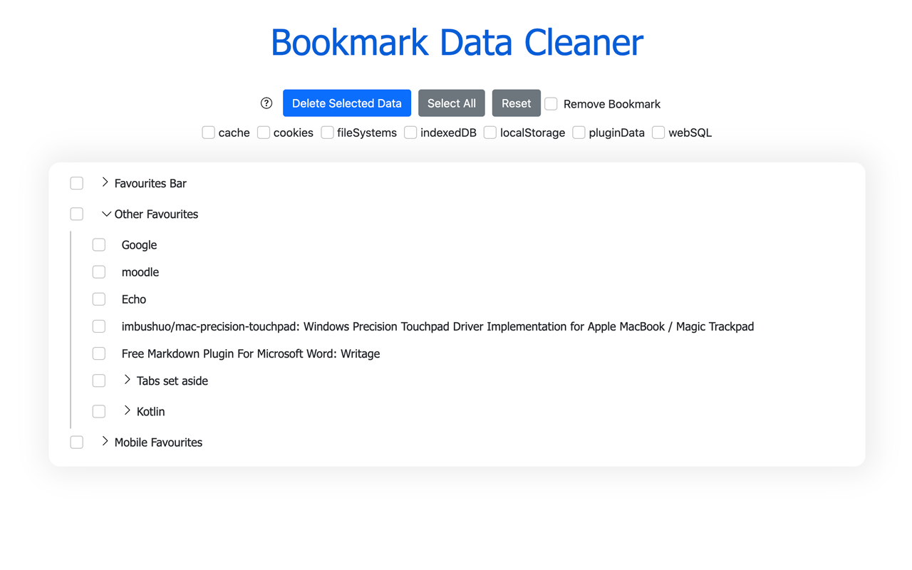
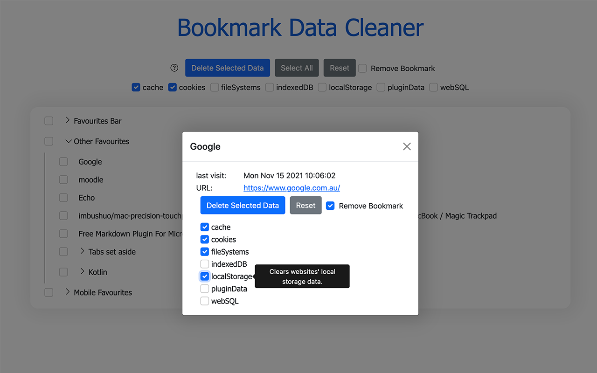

# Bookmark-Cleaner
A Chrome extension that delete all cache, browser data before deleting a bookmark.

## Google Chrome Extension Page

https://chrome.google.com/webstore/detail/bookmark-data-cleaner/fgbajdlddblimpajlokkmkdngpnmmaja?hl=en-GB&authuser=0

## Overview

Bookmark Data Cleaner allows you to efficiently clear related browsing data saved from your bookmarks/favourites (you can also remove the bookmarks/favourites at the same time)

 ☆☆☆ Supported browsing data to clean ☆☆☆

* Cache: Clears the browser's cache (including app caches and cache storage).

* Cookies: Clears the browser's cookies and server-bound certificates modified within a particular timeframe.

* File System Data: Clears websites' file system data..

* IndexedDB Data: Clears websites' IndexedDB (database) data.

* Local Storage:  Clears websites' local storage data.

* Plugin Data: Clears plugins' data.

* Web SQL Data: Clears websites' WebSQL data.

------------------------------------------------------------------

Bookmark Data Cleaner可让您高效地清除书签/收藏夹中保存的相关浏览数据（您也可以同时删除相应的书签/收藏夹）。

 ☆☆☆ 支持清理的浏览数据☆☆☆

* 缓存：清除浏览器的缓存（包括应用缓存和缓存存储）。
* Cookies：清除浏览器的 cookie 和在特定时间范围内修改的服务器绑定证书。
* 文件系统数据：清除网站的文件系统数据..
* IndexedDB 数据：清除网站的IndexedDB（数据库）数据。
* 本地存储：清除网站的本地存储数据。
* 插件数据：清除插件数据。
* Web SQL 数据：清除网站的 WebSQL 数据。

## Screenshots

